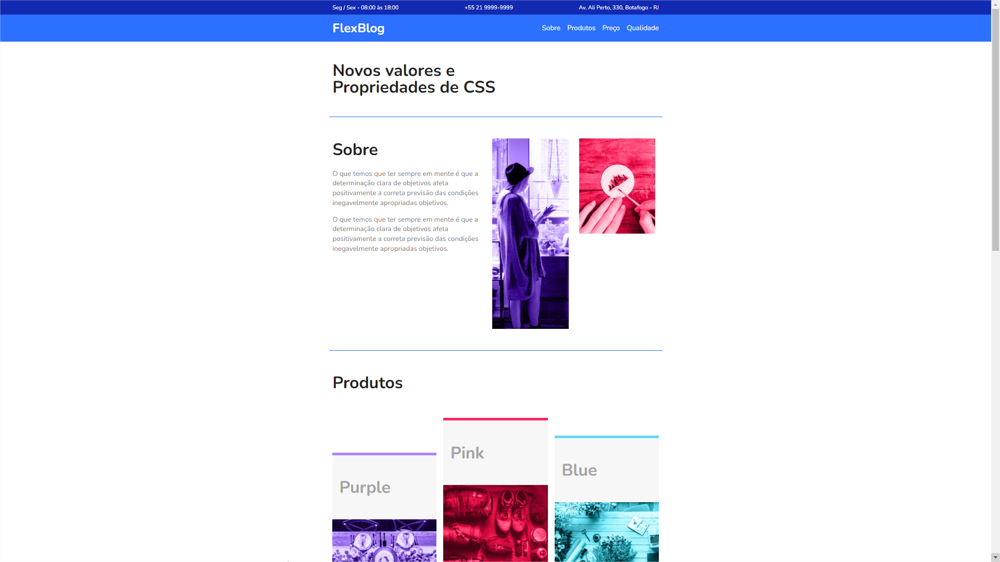

# Flexblog

  <a href="#-tecnologias">Tecnologias</a>&nbsp;&nbsp;&nbsp;|&nbsp;&nbsp;&nbsp;
  <a href="#-projeto">Projeto</a>&nbsp;&nbsp;&nbsp;|&nbsp;&nbsp;&nbsp;
  <a href="#-layout">Layout</a>

 

  

## 🚀 Tecnologias

Esse projeto foi desenvolvido com as seguintes tecnologias:

- HTML
- CSS
- Flexbox
- Media Queries (Responsivo)

## 💻 Projeto

O FlexBlog é um projeto criado a partir do curso feito pela Origamid, onde teve como intuito mostrar a parte teórica, como a parte prática do modelo de layout Flexbox, muito utilizada principalmente pela facilidade em se criar layouts para páginas web com CSS, tanto para desktop, quanto para dispositivos mobile.

## 🔖 Layout

Você pode visualizar o projeto final através [desse link](https://github.com/LucasMengue/flexblog).
